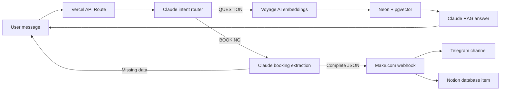

# Medbot: Clinic AI Concierge

<a href="README.md"><strong>Русская версия</strong></a>

MVP AI concierge for a clinic. The bot accepts a user message, classifies the intent, and then follows one of two paths:

- `QUESTION`: answers clinic questions using RAG over the clinic knowledge base.
- `BOOKING`: collects name, phone, service, and date, then sends a completed lead to Make.com.

This is a backend/API project with a small demo page for review. It is not a full clinic website.

## Links

- Try the bot: https://concierge-api-eight.vercel.app
- MCP server (Streamable HTTP): https://concierge-api-eight.vercel.app/api/mcp
- Lead channel: https://t.me/democlinicleads

## Screenshots

Demo chat with a knowledge-base answer and booking flow:


Telegram lead channel:


## Architecture



## MCP Server

The same two concierge operations are exposed as MCP tools, so they can be
attached to Claude Desktop or Claude Code and called from a normal conversation.

- `search_knowledge_base(query, limit?)` - searches the clinic knowledge base;
- `submit_booking(name, phone, service, date)` - sends a lead to Make.com.

Two transports sit on top of a single tool definition (`concierge-api/lib/mcp-tools.js`):

| Transport | Location | How to connect |
| --- | --- | --- |
| Streamable HTTP | `concierge-api/api/mcp.js`, deployed on Vercel | Claude Desktop -> Settings -> Connectors -> Add custom connector -> `https://concierge-api-eight.vercel.app/api/mcp` |
| stdio | `mcp-server/` | `claude mcp add clinic-concierge -- node <path>/mcp-server/dist/index.js` |

The endpoint is public, so it is rate limited per client IP: 120 requests per
hour and 15 bookings per day. The checks fail open - a counter outage never
blocks the demo. See [mcp-server/README.md](mcp-server/README.md) for details.

## Repository Contents

- `concierge-api/api/chat.js` - Vercel Serverless API route.
- `concierge-api/api/mcp.js` - MCP server over Streamable HTTP.
- `concierge-api/lib/clinic-core.js` - shared logic: embeddings, Neon search, lead delivery.
- `concierge-api/lib/mcp-tools.js` - MCP tool definitions shared by both transports.
- `mcp-server/` - local stdio MCP server for Claude Desktop.
- `concierge-api/public/index.html` - demo page for testing the bot.
- `concierge-api/test/chat.test.mjs` - unit tests for routing and booking behavior.
- `concierge-api/scripts/smoke-production.mjs` - production smoke tests.
- `concierge-api/scripts/qa-production.mjs` - extended production QA scenarios.
- `ingest_knowledge_base.py` - imports clinic `.md` files into Neon with Voyage embeddings.
- `create_match_documents.py` - creates the `match_documents` SQL function.
- `md_files/` - source clinic knowledge files.

## Environment Variables

Create `concierge-api/.env.local` from `concierge-api/.env.example`:

```env
ANTHROPIC_API_KEY=sk-ant-...
ANTHROPIC_MODEL=claude-haiku-4-5-20251001
VOYAGE_API_KEY=pa-...
NEON_DATABASE_URL=postgresql://...
MAKE_WEBHOOK_URL=https://hook.eu1.make.com/...
```

Never commit real secrets or local `.env` files.

## Local Development

```bash
cd concierge-api
npm install
npx vercel dev
```

Request example:

```bash
curl -X POST http://localhost:3000/api/chat \
  -H "Content-Type: application/json" \
  -d "{\"message\":\"How much is a therapist appointment?\"}"
```

For reliable multi-step booking sessions, send the same `X-Concierge-Session-Id` header on every request. If the header is missing, the backend falls back to an IP + User-Agent based session key.

## Validation

```bash
cd concierge-api
npm test
npm run smoke:prod
npm run qa:prod
```

The smoke and QA tests run realistic scenarios against the production API. They intentionally avoid submitting a complete fake lead to Make.com.

## Deployment

```bash
cd concierge-api
npx vercel --prod
```
