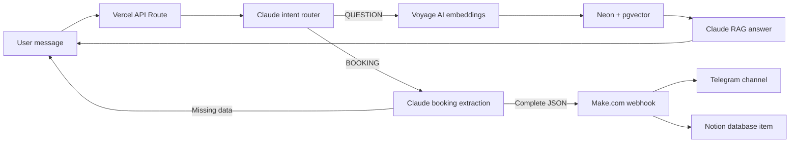

# Medbot Clinic AI Concierge

## Русский

MVP ИИ-консьержа для клиники. Бот принимает сообщение пользователя, классифицирует интент и дальше работает в одном из двух режимов:

- `QUESTION`: отвечает на вопросы по базе знаний клиники через RAG.
- `BOOKING`: собирает имя, телефон, услугу и дату, затем отправляет готовую заявку в Make.com.

Это backend/API проект. Отдельный сайт или полноценный frontend здесь не реализованы. API можно подключить к любому чат-виджету, React-приложению или лендингу.

### Скриншоты

Screenshot 1: Chat widget / Виджет чата


Screenshot 2: Lead delivery / Лид в Telegram или Notion


### Архитектура



### Что внутри

- `concierge-api/api/chat.js` - Vercel Serverless API route.
- `concierge-api/test/chat.test.mjs` - unit tests for routing and booking behavior.
- `concierge-api/scripts/smoke-production.mjs` - 20 production smoke tests.
- `ingest_knowledge_base.py` - imports clinic `.md` files into Neon with Voyage embeddings.
- `create_match_documents.py` - creates the `match_documents` SQL function.
- `md_files/` - source clinic knowledge files.

### Переменные окружения

Create `concierge-api/.env.local` from `concierge-api/.env.example`:

```env
ANTHROPIC_API_KEY=sk-ant-...
ANTHROPIC_MODEL=claude-haiku-4-5-20251001
VOYAGE_API_KEY=pa-...
NEON_DATABASE_URL=postgresql://...
MAKE_WEBHOOK_URL=https://hook.eu1.make.com/...
```

Do not commit real keys or local `.env` files.

### Локальный запуск

```bash
cd concierge-api
npm install
npx vercel dev
```

Request example:

```bash
curl -X POST http://localhost:3000/api/chat \
  -H "Content-Type: application/json" \
  -d "{\"message\":\"Сколько стоит прием терапевта?\"}"
```

For stable multi-step booking sessions, send the same `X-Concierge-Session-Id` header on every request. If the header is missing, the backend falls back to an IP + User-Agent based session key.

### Проверки

```bash
cd concierge-api
npm test
node scripts/smoke-production.mjs
```

The production smoke test runs 20 realistic Russian-language scenarios against the deployed API. It intentionally avoids submitting a complete fake lead to Make.com.

### Деплой

```bash
cd concierge-api
npx vercel --prod
```

Production API:

```text
https://concierge-api-eight.vercel.app/api/chat
```

---

## English

MVP AI concierge for a clinic. The bot accepts a user message, classifies the intent, and then follows one of two paths:

- `QUESTION`: answers clinic questions using RAG over the clinic knowledge base.
- `BOOKING`: collects name, phone, service, and date, then sends a completed lead to Make.com.

This is a backend/API project. It does not include a standalone website or a full frontend. The API can be connected to any chat widget, React app, or landing page.

### Screenshots

Screenshot 1: Chat widget


Screenshot 2: Lead delivery in Telegram or Notion


### Architecture

The Vercel API route uses Claude for intent routing and answer generation, Voyage AI for embeddings, Neon Postgres with `pgvector` for semantic search, and Make.com for lead automation into Telegram and Notion.

### Repository Contents

- `concierge-api/api/chat.js` - Vercel Serverless API route.
- `concierge-api/test/chat.test.mjs` - unit tests for routing and booking behavior.
- `concierge-api/scripts/smoke-production.mjs` - 20 production smoke tests.
- `ingest_knowledge_base.py` - imports clinic `.md` files into Neon with Voyage embeddings.
- `create_match_documents.py` - creates the `match_documents` SQL function.
- `md_files/` - source clinic knowledge files.

### Environment Variables

Create `concierge-api/.env.local` from `concierge-api/.env.example`:

```env
ANTHROPIC_API_KEY=sk-ant-...
ANTHROPIC_MODEL=claude-haiku-4-5-20251001
VOYAGE_API_KEY=pa-...
NEON_DATABASE_URL=postgresql://...
MAKE_WEBHOOK_URL=https://hook.eu1.make.com/...
```

Never commit real secrets or local `.env` files.

### Local Development

```bash
cd concierge-api
npm install
npx vercel dev
```

Request example:

```bash
curl -X POST http://localhost:3000/api/chat \
  -H "Content-Type: application/json" \
  -d "{\"message\":\"How much is a therapist appointment?\"}"
```

For reliable multi-step booking sessions, send the same `X-Concierge-Session-Id` header on every request. If the header is missing, the backend falls back to an IP + User-Agent based session key.

### Validation

```bash
cd concierge-api
npm test
node scripts/smoke-production.mjs
```

The production smoke test runs 20 realistic Russian-language scenarios against the deployed API. It intentionally avoids submitting a complete fake lead to Make.com.

### Deployment

```bash
cd concierge-api
npx vercel --prod
```

Production API:

```text
https://concierge-api-eight.vercel.app/api/chat
```
