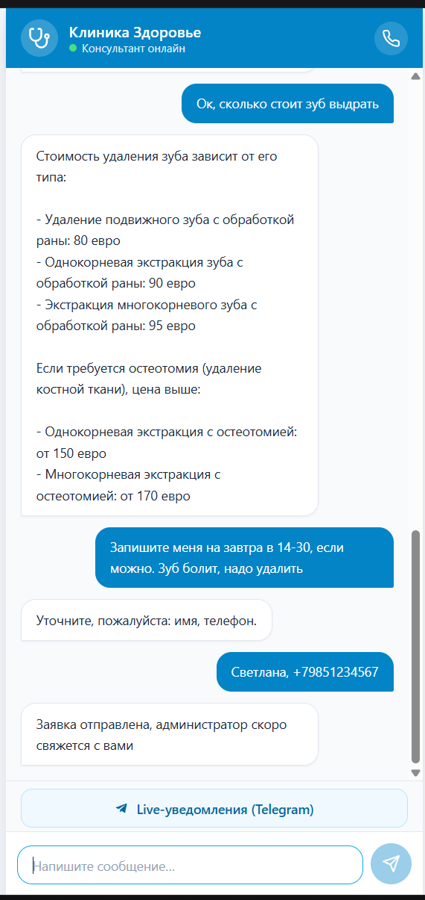
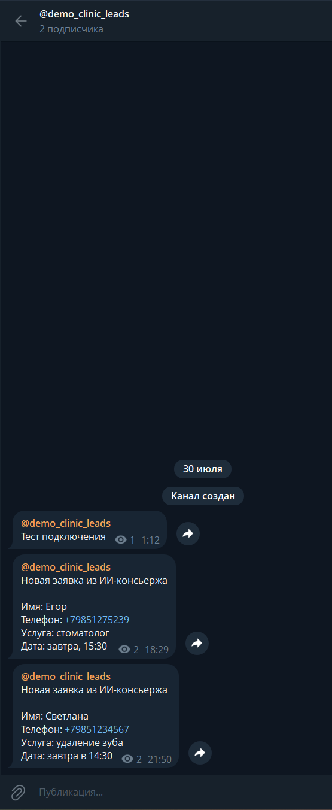
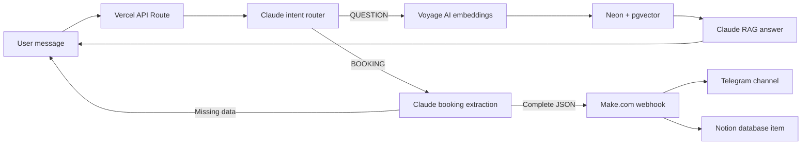

# Medbot: ИИ-консьерж для клиники

<a href="README.en.md"><strong>English version</strong></a>

MVP ИИ-консьержа для клиники. Бот принимает сообщение пользователя, классифицирует интент и дальше работает в одном из двух режимов:

- `QUESTION`: отвечает на вопросы по базе знаний клиники через RAG.
- `BOOKING`: собирает имя, телефон, услугу и дату, затем отправляет готовую заявку в Make.com.

Это backend/API проект с небольшой demo-страницей для проверки. Полноценный сайт клиники здесь не реализован.

## Ссылки

- Попробовать бота: https://concierge-api-eight.vercel.app
- MCP-сервер (Streamable HTTP): https://concierge-api-eight.vercel.app/api/mcp
- Чат/канал лидов: https://t.me/democlinicleads

## Скриншоты

Demo-чат с ответом по базе знаний и оформлением заявки:



Telegram-канал с лидами из ИИ-консьержа:



## Архитектура



## Что внутри

- `concierge-api/api/chat.js` - Vercel Serverless API route.
- `concierge-api/lib/clinic-core.js` - общий модуль: эмбеддинг, поиск в Neon, отправка лида в Make.
- `mcp-server/` - MCP-сервер (stdio) с тулами `search_knowledge_base` и `submit_booking` для Claude Desktop / Claude Code.
- `concierge-api/public/index.html` - demo-страница для проверки бота.
- `concierge-api/test/chat.test.mjs` - unit-тесты маршрутизации и записи.
- `concierge-api/scripts/smoke-production.mjs` - production smoke-тесты.
- `concierge-api/scripts/qa-production.mjs` - расширенный QA-набор production-сценариев.
- `ingest_knowledge_base.py` - загрузка `.md` файлов клиники в Neon с эмбеддингами Voyage.
- `create_match_documents.py` - создание SQL-функции `match_documents`.
- `md_files/` - исходные markdown-файлы базы знаний клиники.

## Переменные окружения

Создайте `concierge-api/.env.local` из `concierge-api/.env.example`:

```env
ANTHROPIC_API_KEY=sk-ant-...
ANTHROPIC_MODEL=claude-haiku-4-5-20251001
VOYAGE_API_KEY=pa-...
NEON_DATABASE_URL=postgresql://...
MAKE_WEBHOOK_URL=https://hook.eu1.make.com/...
```

Не коммитьте реальные ключи и локальные `.env` файлы.

## Локальный запуск

```bash
cd concierge-api
npm install
npx vercel dev
```

Пример запроса:

```bash
curl -X POST http://localhost:3000/api/chat \
  -H "Content-Type: application/json" \
  -d "{\"message\":\"Сколько стоит прием терапевта?\"}"
```

Для стабильной многошаговой записи передавайте один и тот же заголовок `X-Concierge-Session-Id` в каждом запросе. Если заголовка нет, backend использует ключ на основе IP и User-Agent.

## Проверки

```bash
cd concierge-api
npm test
npm run smoke:prod
npm run qa:prod
```

Smoke- и QA-тесты гоняют реалистичные сценарии против production API и специально не отправляют завершенный фейковый лид в Make.com.

## Деплой

```bash
cd concierge-api
npx vercel --prod
```
