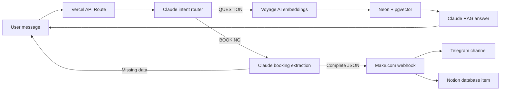

# Medbot: ИИ-консьерж для клиники

<a href="README.en.md"><strong>English version</strong></a>

MVP ИИ-консьержа для клиники. Бот принимает сообщение пользователя, классифицирует интент и дальше работает в одном из двух режимов:

- `QUESTION`: отвечает на вопросы по базе знаний клиники через RAG.
- `BOOKING`: собирает имя, телефон, услугу и дату, затем отправляет готовую заявку в Make.com.

Это backend/API проект с маленькой demo-страницей для проверки. Полноценный сайт клиники здесь не реализован.

## Ссылки

- Попробовать бота: https://concierge-api-eight.vercel.app
- Production API: https://concierge-api-eight.vercel.app/api/chat
- MCP-сервер (Streamable HTTP): https://concierge-api-eight.vercel.app/api/mcp
- Чат/канал лидов: https://t.me/democlinicleads

## Скриншоты

Demo-чат с ответом по базе знаний и оформлением заявки:


Telegram-канал с лидами из ИИ-консьержа:


## Архитектура



## MCP-сервер

Те же две операции консьержа доступны как MCP-инструменты: их можно подключить
к Claude Desktop или Claude Code и вызывать из обычного диалога.

- `search_knowledge_base(query, limit?)` - поиск по базе знаний клиники;
- `submit_booking(name, phone, service, date)` - отправка заявки в Make.com.

Два транспорта поверх одного описания тулов (`concierge-api/lib/mcp-tools.js`):

| Транспорт | Где живёт | Как подключить |
| --- | --- | --- |
| Streamable HTTP | `concierge-api/api/mcp.js`, деплоится на Vercel | Claude Desktop -> Settings -> Connectors -> Add custom connector -> `https://concierge-api-eight.vercel.app/api/mcp` |
| stdio | `mcp-server/` | `claude mcp add clinic-concierge -- node <путь>/mcp-server/dist/index.js` |

Эндпоинт публичный, поэтому ограничен по частоте с одного IP: 120 запросов в
час и 15 заявок в сутки. Проверки fail-open - сбой счётчика не блокирует демо.
Подробности в [mcp-server/README.md](mcp-server/README.md).

### Попробовать

1. Claude Desktop -> Settings -> Connectors -> Add custom connector, вставить
   `https://concierge-api-eight.vercel.app/api/mcp`.
2. В новом чате спросить: «Через search_knowledge_base узнай, сколько стоит
   приём семейного врача» - Claude сходит в базу клиники и ответит по найденным
   документам.
3. Оформить запись: «Запиши через submit_booking: Анна, +371 29999999, УЗИ
   щитовидной железы, завтра в 15:00» - заявка уйдёт в Make.com и появится в
   [демо-канале лидов](https://t.me/democlinicleads).

Открывать `/api/mcp` в браузере бесполезно: это JSON-RPC эндпоинт, он отвечает
только на POST.

## Что внутри

- `concierge-api/api/chat.js` - Vercel Serverless API route.
- `concierge-api/api/mcp.js` - MCP-сервер по Streamable HTTP.
- `concierge-api/lib/clinic-core.js` - общая логика: эмбеддинг, поиск в Neon, отправка лида.
- `concierge-api/lib/mcp-tools.js` - описание MCP-тулов, одно на оба транспорта.
- `mcp-server/` - локальный MCP-сервер по stdio для Claude Desktop.
- `concierge-api/public/index.html` - demo-страница для проверки бота.
- `concierge-api/test/chat.test.mjs` - unit-тесты маршрутизации и записи.
- `concierge-api/scripts/smoke-production.mjs` - production smoke-тесты.
- `concierge-api/scripts/qa-production.mjs` - расширенный QA-набор production-сценариев.
- `ingest_knowledge_base.py` - загрузка `.md` файлов клиники в Neon с эмбеддингами Voyage.
- `create_match_documents.py` - создание SQL-функции `match_documents`.
- `md_files/` - исходные markdown-файлы базы знаний клиники.

## Переменные окружения

Создайте `concierge-api/.env.local` из `concierge-api/.env.example`:

```env
ANTHROPIC_API_KEY=sk-ant-...
ANTHROPIC_MODEL=claude-haiku-4-5-20251001
VOYAGE_API_KEY=pa-...
NEON_DATABASE_URL=postgresql://...
MAKE_WEBHOOK_URL=https://hook.eu1.make.com/...
```

Не коммитьте реальные ключи и локальные `.env` файлы.

## Локальный запуск

```bash
cd concierge-api
npm install
npx vercel dev
```

Пример запроса:

```bash
curl -X POST http://localhost:3000/api/chat \
  -H "Content-Type: application/json" \
  -d "{\"message\":\"Сколько стоит прием терапевта?\"}"
```

Для стабильной многошаговой записи передавайте один и тот же заголовок `X-Concierge-Session-Id` в каждом запросе. Если заголовка нет, backend использует ключ на основе IP и User-Agent.

## Проверки

```bash
cd concierge-api
npm test
npm run smoke:prod
npm run qa:prod
```

Smoke- и QA-тесты гоняют реалистичные сценарии против production API и специально не отправляют завершенный фейковый лид в Make.com.

## Деплой

```bash
cd concierge-api
npx vercel --prod
```
